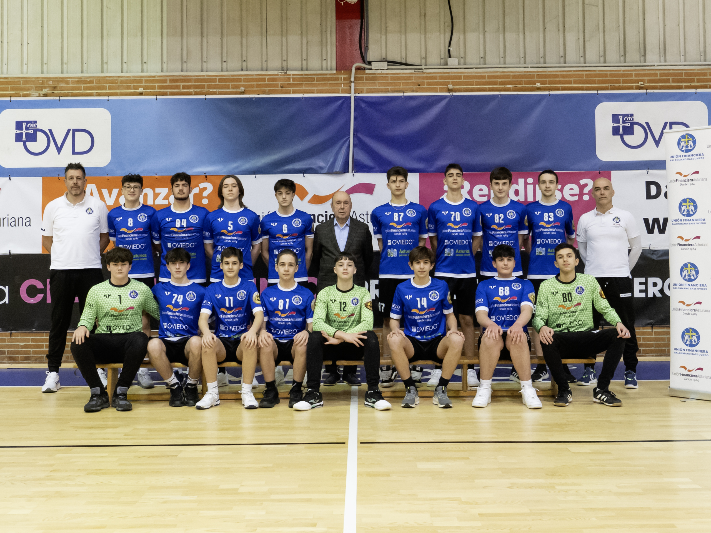
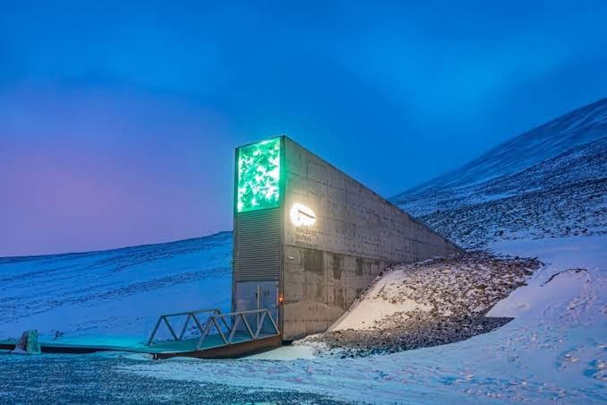

[← Volver al inicio](README.md)
# Temas del curso

### 18/9/26 - Mis aficiones

Llevo jugando balonmano desde los 7 años,
antes de eso, hacia taekwondo y ahora me estoy centrando mucho más en el gimnasio,
por lo que se podría decir que mi afición es el deporte en general.
Siempre me han gustado mucho los deportes de pelota,
ya sea baloncesto,futbol o el ya mencionado balonmano

[Buscando en Github he encontrado:](https://github.com/djbrown/hbscorez)

###1/10 · Premios princesa de Asturias: Bóveda global de semillas de Svalbard###

He elegido la bóveda global de semillas de Svalbard para hacer el trabajo de los premios princesa
Ésta bóveda construida en el 2008 en el archipiélago noruego de Svalbard, en la isla de Spitsbergen
fue construido con la intención de guardar semillas en caso de falta de alimento 48
por guerras, desastres naturales, etc...
Fue galardonado debido a demostrar su eficacia durante conflictos bélicos, suministrando alimento
a toda la población.

[Su página en la fundación](https://www.fpa.es/es/premios-princesa-de-asturias/premiados/2026-boveda-global-de-semillas-svalbard/?texto=trayectoria)

